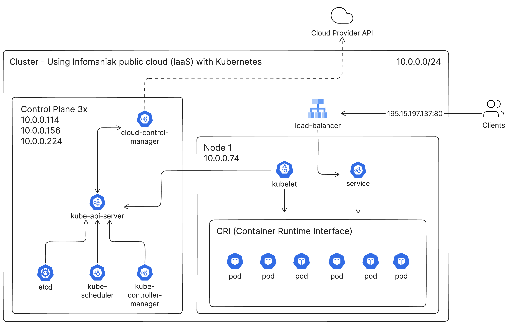

# Kubernetes Cluster on Infomaniak Public Cloud

## Group Members (Group 4)
- Gwendal Piemontesi
- Dario Vasques
- Ewan Mariaux
- Guillaume Trüeb

## POC Objectives

Validate the possible use of Infomaniak's Public Cloud for a startup that needs to deploy containers on the web using Kubernetes.

## Infrastructure Architecture

The Kubernetes documentation provides a cluster architecture diagram that illustrates how it works.



In our case, we want to deploy the content of CLD lab 5 (Kubernetes on Google Cloud) on a Swiss cloud, which offers better data protection and security. Since we want complete control of the cloud platform to install Kubernetes, we will use IaaS (Infrastructure as a Service) instead of CaaS (Container as a Service).

Through our analysis, we found that Infomaniak offers a Jelastic Cloud, considered a PaaS (Platform as a Service). They also provide the option to install our own servers directly in their data center. This could be a good option if you already have hardware but lack the capacity to store it in your office.


## Scenario

Describe step-by-step the scenario. Write it using this format (BDD style).

### STEP 01
```
given -> we don't have any cloud platform to host our containers

when -> we want to create a project using Infomaniak IaaS services (Public Cloud) and give access to the project to our team

then -> create a project on the cloud platform and make our OpenStack platform accessible to our team
```

### STEP 02
```
given -> we have access to our OpenStack with Horizon or CLI

when -> we document ourselves to prepare the commands to create the cluster

then -> we have created the cluster on our OpenStack platform
```

### STEP 03
```
given -> we have a running Kubernetes cluster

when -> we want to ensure that the cluster can do auto-scaling on pods by deleting some of them and control that it recreates them

then -> the cluster can start pods automatically
```

### STEP 04
```
given -> we have a running Kubernetes cluster capable of auto-scaling pods

when -> we want to perform a load test on the cluster to ensure it can handle many connections at the same time

then -> the tests validate that the cluster handles multiple connections correctly at the same time and show metrics
```

## Cost
### Estimation
Based on an estimation we made with the Infomaniak Price Calculator ([here](https://infomaniak.cloud/calculator?uuid=098009b5-bad3-45d6-a9c6-bfce2b6e844f)), the cost will be around 13 CHF per month.

### Reality
As we needed to significantly upgrade our infrastructure, we are now spending about 73 CHF per month for 3 control planes, 1 worker, 2 load balancers, storage, and 2 IP addresses. You can find the details based on the price calculator from Infomaniak [here](https://infomaniak.cloud/calculator?uuid=c213684f-019a-4a6c-8403-bbe274cb89ab).

## Return of Experience

This workshop has been a great tool to enhance our knowledge about Kubernetes. We think it's a great opportunity to use a Swiss cloud company to host our applications and services, which is why we opted to use Infomaniak Public Cloud to deploy a Kubernetes cluster.

### Did it validate the announced objectives?
In our opinion, completely. We have been able to host a two-tier application, which could be typical for a startup.
